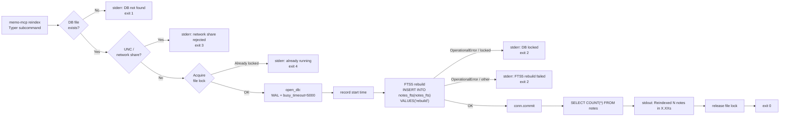

# Batch Job Design — memo-mcp reindex (2026-05-01 09:00)

Framework: Python 3.11+, Typer CLI, SQLite built-in + FTS5
Stack: SQLite + WAL, FTS5 external-content table, uv_build, PyPI package `memo-mcp`

---

## 1. Contract

| Field | Value |
|-------|-------|
| Trigger | Manual (`memo-mcp reindex`) or optional cron (nightly recommendation) |
| Input | `notes` table — all rows, no filter |
| Output | `notes_fts` FTS5 virtual table (rebuilt in-place via FTS5 `'rebuild'` command) |
| Scale | Personal tool; expected < 10,000 notes; rebuild completes in < 1s for typical use |
| SLA | No hard SLA; expected runtime < 5s even for large personal databases |
| Failure tolerance | All-or-nothing (FTS5 `'rebuild'` is atomic; either succeeds or leaves index unchanged) |
| Order | Not applicable (FTS5 `'rebuild'` reads the content table in its own order) |
| Concurrency | One run at a time — a second concurrent run must be blocked or serialised |
| DB auto-create | No — if the DB file does not exist, exit 1 with an error message |

---

## 2. Step graph



---

## 3. Idempotency

`memo-mcp reindex` is unconditionally safe to run multiple times.

**Why:** The FTS5 `'rebuild'` command is a built-in SQLite operation that atomically drops all content from `notes_fts` and repopulates it by reading every row in the `notes` content table. It does not depend on any prior state of `notes_fts` — a corrupt index, an empty index, and a fully-correct index all produce the same result after `'rebuild'` completes.

**State after each run:** `notes_fts` is a byte-for-byte equivalent representation of `notes.body` indexed by FTS5's `unicode61` tokenizer. The three sync triggers (INSERT/UPDATE/DELETE) keep the index in sync going forward.

**Implication:** Running `memo-mcp reindex` twice in a row produces the same end state. There is no cleanup needed before re-running, no marker to clear, and no compensating action. An operator can schedule it nightly with no concern about double-application.

---

## 4. Single-process locking

### Recommendation: portable file lock via `filelock` (third-party, cross-platform)

**Lock file location:** `<db_dir>/.memo-mcp-reindex.lock`
(same directory as the DB, so the lock lives alongside the data it protects.)

**Why not rely on SQLite's WAL write lock alone?**

The WAL write lock would serialise two concurrent reindex runs naturally (the second waits up to `busy_timeout=5000 ms`, then either succeeds or raises `OperationalError`). This is technically safe — `'rebuild'` is idempotent — but it produces a confusing user experience: the second run silently succeeds after a 5-second delay with no indication that another run was in progress. A file lock lets us detect the conflict immediately and print a clear error.

**Why not `fcntl` (Unix) / `msvcrt` (Windows) directly?**

The `filelock` package (`pip install filelock`) provides a cross-platform, well-tested, context-manager-style lock that handles both Unix (`fcntl.flock`) and Windows (`msvcrt.locking`) internally. It is a zero-dependency pure-Python package and is already a transitive dependency of many Python toolchains (pip, virtualenv). Adding it as an explicit dependency is low-cost and high-value for cross-platform correctness.

**Lock acquisition behaviour:**

```python
from filelock import FileLock, Timeout

lock = FileLock(lock_path, timeout=0)  # timeout=0 = non-blocking
try:
    with lock:
        # run reindex
except Timeout:
    # another reindex is running
    typer.echo("error: another reindex is already running", err=True)
    raise typer.Exit(code=4)
```

`timeout=0` makes acquisition non-blocking: if the lock is held, `Timeout` is raised immediately. This is the correct UX for a CLI tool — fail fast with a clear message rather than silently waiting.

**Lock release:** The `with lock:` context manager releases the lock on exit, including on exceptions and on `KeyboardInterrupt`. The lock file itself is left on disk (harmless; it is re-acquired on the next run).

---

## 5. Exit codes

| Code | Meaning | When |
|------|---------|------|
| `0` | Success | Rebuild completed; summary line printed to stdout |
| `1` | DB not found | `MEMO_MCP_DB_PATH` or `~/.memo-mcp/notes.db` does not exist |
| `2` | DB error | `sqlite3.OperationalError` during `open_db`, `'rebuild'`, or `COUNT(*)` — includes "database is locked" after busy_timeout exhausted and any FTS5 rebuild failure |
| `3` | Invalid DB path | DB path is a UNC/network-share path (WAL not supported) |
| `4` | Already running | File lock could not be acquired — another `memo-mcp reindex` process is active |

**Design rationale:** Exit code 2 covers all SQLite errors rather than splitting them further. The distinction matters for automated orchestration; for a personal CLI tool a single "DB error" category keeps the contract simple. The specific failure reason is always printed to stderr.

---

## 6. Typer command signature

```python
# src/memo_mcp/cli.py

import os
import pathlib
import sqlite3
import time
from typing import Annotated, Optional

import typer
from filelock import FileLock, Timeout

app = typer.Typer(name="memo-mcp", add_completion=False)


@app.command()
def reindex(
    db_path: Annotated[
        Optional[str],
        typer.Option(
            "--db",
            envvar="MEMO_MCP_DB_PATH",
            help="Path to the SQLite database. Defaults to ~/.memo-mcp/notes.db.",
            show_default=False,
        ),
    ] = None,
) -> None:
    """Rebuild the FTS5 full-text search index from the notes table.

    Safe to run at any time. Existing search results remain available
    until the rebuild completes. Use this after manual DB edits,
    interrupted writes, or memo-mcp upgrades.
    """
    _run_reindex(db_path)
```

**Notes on the signature:**

- `--db` / `MEMO_MCP_DB_PATH` follows the same resolution order used by the server: explicit flag beats env var beats default path.
- No `--verbose` flag — the locked-in decision is summary-line-only output.
- No `--dry-run` flag — a dry-run of an index rebuild is meaningless.
- `add_completion=False` on the Typer app is a project-level preference.

---

## 7. Error handling

### 7a. DB file does not exist

```python
resolved = pathlib.Path(db_path or os.environ.get("MEMO_MCP_DB_PATH") or
                        pathlib.Path.home() / ".memo-mcp" / "notes.db").resolve()

if not resolved.exists():
    typer.echo(
        f"error: database not found: {resolved}\n"
        f"Run a memo-mcp tool first to create the database, or set MEMO_MCP_DB_PATH.",
        err=True,
    )
    raise typer.Exit(code=1)
```

`reindex` must not create the DB — if the file is absent, the user has not yet used `memo-mcp` and there is nothing to index.

### 7b. UNC / network-share path

```python
raw = str(resolved)
if raw.startswith("\\\\") or raw.startswith("//"):
    typer.echo(
        f"error: database path is a network share, which is not supported (WAL requires local filesystem): {resolved}",
        err=True,
    )
    raise typer.Exit(code=3)
```

### 7c. Another reindex already running

```python
lock_path = resolved.parent / ".memo-mcp-reindex.lock"
lock = FileLock(str(lock_path), timeout=0)
try:
    with lock:
        _do_reindex(resolved)
except Timeout:
    typer.echo("error: another memo-mcp reindex is already running", err=True)
    raise typer.Exit(code=4)
```

### 7d. DB locked (busy_timeout exhausted)

```python
except sqlite3.OperationalError as exc:
    if "locked" in str(exc).lower():
        typer.echo(
            f"error: database is locked (another process holds a write lock): {exc}\n"
            "Wait a moment and try again.",
            err=True,
        )
    else:
        typer.echo(f"error: FTS5 rebuild failed: {exc}", err=True)
    raise typer.Exit(code=2)
```

### 7e. FTS5 rebuild raises OperationalError (non-lock)

Caught by the same `except sqlite3.OperationalError` branch above. The error message is printed to stderr with the SQLite exception text; exit code 2. Possible causes: corrupted DB file, disk full during rebuild. The `notes` table is untouched in all cases.

---

## 8. Scheduling guidance

`reindex` is a recovery/maintenance tool, not a required nightly job. The three sync triggers keep `notes_fts` in sync during normal operation. Scheduling a nightly reindex provides a belt-and-suspenders safety net.

### Linux / macOS — crontab

```cron
# Rebuild the memo-mcp FTS5 index nightly at 03:00 local time
0 3 * * * /usr/local/bin/memo-mcp reindex >> /dev/null

# With log file:
0 3 * * * /usr/local/bin/memo-mcp reindex >> ~/.memo-mcp/reindex.log 2>&1
```

**Install:** `crontab -e`, then paste the line above. Use `which memo-mcp` to find the binary path.

**MEMO_MCP_DB_PATH in cron:** cron runs with a minimal environment. Set the env var explicitly in the crontab if the DB is not at the default path:

```cron
MEMO_MCP_DB_PATH=/data/my-notes.db
0 3 * * * /usr/local/bin/memo-mcp reindex >> /dev/null
```

### Windows — Task Scheduler

1. Open Task Scheduler → Create Basic Task.
2. Name: `memo-mcp nightly reindex`.
3. Trigger: Daily, 03:00.
4. Action: Start a program.
   - Program: result of `where memo-mcp` (e.g., `C:\Users\<you>\AppData\Roaming\Python\Scripts\memo-mcp.exe`)
   - Arguments: `reindex`
5. Settings: "If the task is already running, do not start a new instance".
6. Set `MEMO_MCP_DB_PATH` as a User environment variable if DB is not at the default path.

**Time recommendation:** 03:00 local time — low-traffic for a personal tool; avoids midnight DST boundary.

---

## 9. Timing

```python
start = time.perf_counter()
# ... run rebuild ...
elapsed = time.perf_counter() - start
typer.echo(f"Reindexed {count} notes in {elapsed:.2f}s")
```

Use `time.perf_counter()` — monotonic, sub-millisecond resolution, unaffected by system clock adjustments. Format: `X.XXs` (two decimal places). Typical output for a personal database: `0.01s`–`0.50s`.

**Output destination:** stdout. The summary line is the successful result of the command, not a log message. stdout is safe for `reindex` — this is not the MCP server process.

---

## 10. CLI invocation

### Basic usage

```sh
memo-mcp reindex
```

Expected stdout on success:
```
Reindexed 142 notes in 0.03s
```

### Override DB path via env var

```sh
MEMO_MCP_DB_PATH=/data/my-notes.db memo-mcp reindex
```

### Override DB path via flag

```sh
memo-mcp reindex --db /data/my-notes.db
```

### Failure output examples

DB not found (exit 1):
```
error: database not found: /home/user/.memo-mcp/notes.db
Run a memo-mcp tool first to create the database, or set MEMO_MCP_DB_PATH.
```

Already running (exit 4):
```
error: another memo-mcp reindex is already running
```

DB locked (exit 2):
```
error: database is locked (another process holds a write lock): database is locked
Wait a moment and try again.
```

---

## 11. When to run reindex

| Situation | Why |
|-----------|-----|
| After manual edits to `notes` with an external SQLite tool | Sync triggers do not fire for writes outside the `memo-mcp` server |
| After an interrupted write (power loss, `kill -9` mid-transaction) | WAL recovery restores `notes`; FTS index may be stale |
| After upgrading `memo-mcp` to a new version | Tokenizer config or trigger definitions may have changed |
| After restoring `notes` from a backup | Backup may not include a consistent `notes_fts` snapshot |
| When `notes.search` returns unexpected or missing results | Symptom of FTS drift; reindex is the fix |
| As scheduled nightly maintenance | Belt-and-suspenders safety net; negligible runtime cost |

---

## 12. Implementation sketch

```python
# src/memo_mcp/cli.py

from __future__ import annotations

import os
import pathlib
import sqlite3
import time
from typing import Annotated, Optional

import typer
from filelock import FileLock, Timeout

app = typer.Typer(name="memo-mcp", add_completion=False)


def _resolve_db_path(db_path: str | None) -> pathlib.Path:
    raw = db_path or os.environ.get("MEMO_MCP_DB_PATH") or str(
        pathlib.Path.home() / ".memo-mcp" / "notes.db"
    )
    return pathlib.Path(raw).resolve()


def _open_db(resolved: pathlib.Path) -> sqlite3.Connection:
    conn = sqlite3.connect(str(resolved))
    conn.row_factory = sqlite3.Row
    conn.execute("PRAGMA journal_mode=WAL")
    conn.execute("PRAGMA busy_timeout=5000")
    return conn


def _do_rebuild(conn: sqlite3.Connection) -> int:
    """Execute FTS5 rebuild and return the note count."""
    conn.execute("INSERT INTO notes_fts(notes_fts) VALUES('rebuild')")
    conn.commit()
    return conn.execute("SELECT COUNT(*) FROM notes").fetchone()[0]


@app.command()
def reindex(
    db_path: Annotated[
        Optional[str],
        typer.Option(
            "--db",
            envvar="MEMO_MCP_DB_PATH",
            help="Path to the SQLite database. Defaults to ~/.memo-mcp/notes.db.",
            show_default=False,
        ),
    ] = None,
) -> None:
    """Rebuild the FTS5 full-text search index from the notes table.

    Safe to run at any time. Use after manual DB edits, interrupted writes,
    or memo-mcp upgrades. Recommended: schedule nightly via cron or Task Scheduler.
    """
    resolved = _resolve_db_path(db_path)

    # Guard: network share
    raw = str(resolved)
    if raw.startswith("\\\\") or raw.startswith("//"):
        typer.echo(
            f"error: database path is a network share (WAL requires local filesystem): {resolved}",
            err=True,
        )
        raise typer.Exit(code=3)

    # Guard: DB must already exist
    if not resolved.exists():
        typer.echo(
            f"error: database not found: {resolved}\n"
            "Run a memo-mcp tool first to create the database, or set MEMO_MCP_DB_PATH.",
            err=True,
        )
        raise typer.Exit(code=1)

    # Single-process lock
    lock_path = resolved.parent / ".memo-mcp-reindex.lock"
    lock = FileLock(str(lock_path), timeout=0)  # non-blocking

    try:
        with lock:
            _run_reindex_locked(resolved)
    except Timeout:
        typer.echo("error: another memo-mcp reindex is already running", err=True)
        raise typer.Exit(code=4)


def _run_reindex_locked(resolved: pathlib.Path) -> None:
    """Open DB and run the rebuild. Called only when file lock is held."""
    try:
        conn = _open_db(resolved)
    except sqlite3.OperationalError as exc:
        typer.echo(f"error: could not open database: {exc}", err=True)
        raise typer.Exit(code=2)

    start = time.perf_counter()

    try:
        count = _do_rebuild(conn)
    except sqlite3.OperationalError as exc:
        msg = str(exc).lower()
        if "locked" in msg:
            typer.echo(
                f"error: database is locked (another process holds a write lock): {exc}\n"
                "Wait a moment and try again.",
                err=True,
            )
        else:
            typer.echo(f"error: FTS5 rebuild failed: {exc}", err=True)
        raise typer.Exit(code=2)
    finally:
        conn.close()

    elapsed = time.perf_counter() - start
    typer.echo(f"Reindexed {count} notes in {elapsed:.2f}s")


if __name__ == "__main__":
    app()
```

### Dependency addition (`pyproject.toml`)

```toml
[project]
dependencies = [
    "fastmcp>=2.0",
    "typer>=0.12",
    "filelock>=3.13",
]
```

---

## 13. Retry and skip policy

`reindex` is a single atomic operation — there is no per-record retry or skip.

| Failure | Action |
|---------|--------|
| `busy_timeout` exhausted (DB locked) | Fail immediately; exit 2; user retries manually |
| `OperationalError` during rebuild (disk full, corruption) | Fail immediately; exit 2; re-run after fixing root cause |
| `KeyboardInterrupt` (Ctrl+C mid-rebuild) | File lock released by context manager; SQLite rolls back uncommitted transaction; index reverts to pre-rebuild state; re-run to complete |
| COUNT query fails after successful rebuild | Exit 2 with error; index is correct even if count not printed |

**No DLQ.** There are no individual records to dead-letter. The unit of work is the entire index rebuild.

**Partial rebuild (Ctrl+C):** FTS5 `'rebuild'` runs inside a single SQLite transaction. If interrupted before `conn.commit()`, SQLite rolls back automatically. The index reverts to its pre-rebuild state (possibly stale, not corrupted). A subsequent `reindex` run completes the rebuild cleanly.

---

## 14. Observability

Intentionally minimal for a personal CLI tool.

- **stdout:** `Reindexed N notes in X.XXs` (success only)
- **stderr:** Error messages on failure, always including the SQLite exception text
- **Exit code:** Consumed by the calling shell or scheduler; non-zero exit triggers cron mail by default
- **Optional log file:** `memo-mcp reindex >> ~/.memo-mcp/reindex.log 2>&1` — appends one line per run

No metrics, no tracing, no alerting. Cross-reference `observability-setup` if memo-mcp becomes a multi-user service.

---

## 15. Test plan

| Test | What it verifies |
|------|-----------------|
| Unit: `_do_rebuild` with in-memory SQLite | FTS5 `'rebuild'` runs without error; COUNT returns correct value |
| Unit: `_resolve_db_path` | Env var overrides default; explicit arg overrides env var |
| CLI: DB not found | `typer.testing.CliRunner`; assert exit 1, stderr contains "not found" |
| CLI: UNC path | Assert exit 3, stderr contains "network share" |
| CLI: successful reindex | Create DB with 5 notes; run `reindex`; assert exit 0, stdout matches `Reindexed 5 notes in` |
| CLI: idempotency | Run `reindex` twice on same DB; assert both exits are 0, COUNT stable |
| CLI: concurrent lock | Acquire `FileLock` manually in test; run `reindex`; assert exit 4 |
| Integration: FTS drift recovery | Manually delete all rows from `notes_fts`; run `reindex`; assert search returns results |

---

## 16. Open questions

None. All decisions are locked in. This document is the input to `implementation-plan` for the `reindex` subcommand.

---

## Next step

Run `implementation-plan` using this document alongside T5 (generate-technical-design) as inputs to generate the full ordered implementation task list.
