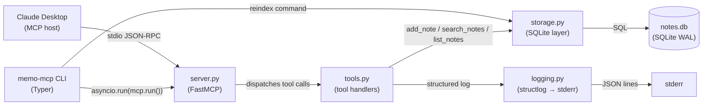
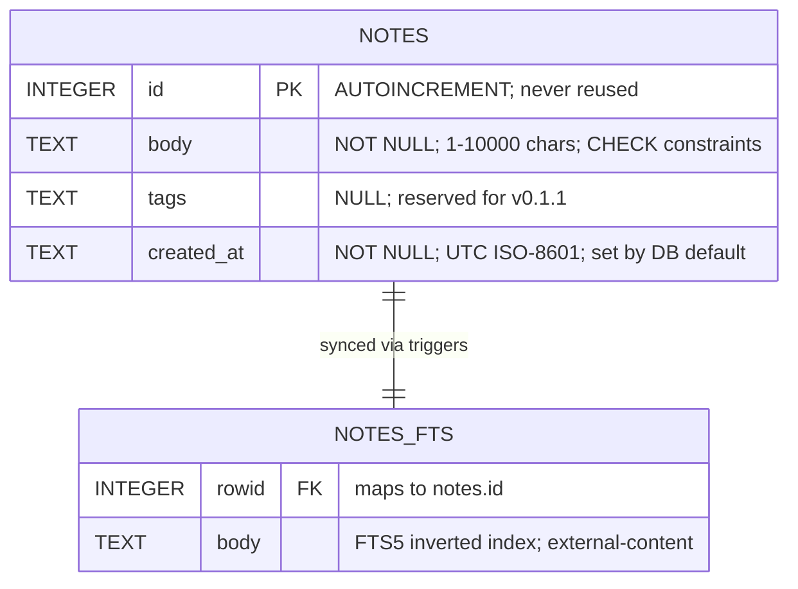
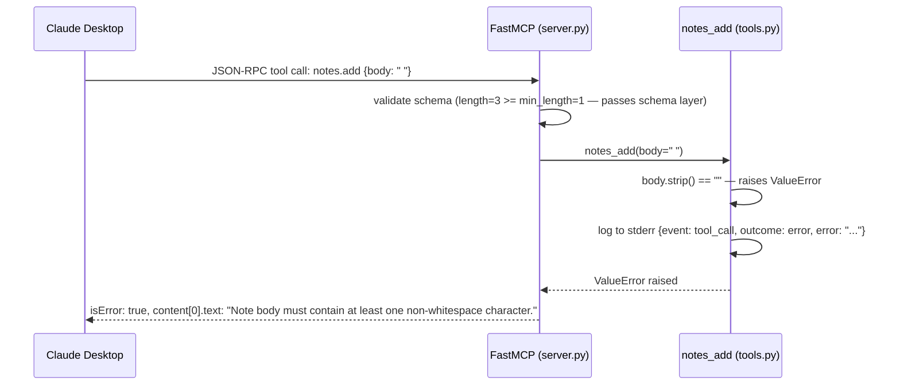
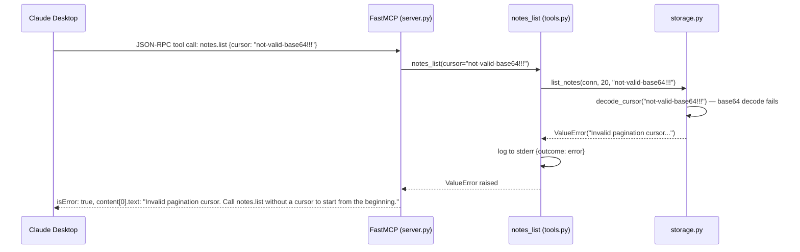

# Technical Design — memo-mcp v0.1.0 (2026-05-01 09:00)

> **Inputs:** technical-research (T1), functional-design (T2), api-design (T3), database-design (T4)
> **Next step:** implementation-plan — break this design into ordered coding tasks

---

## 1. Problem and constraints

**Built for:** A single developer (Marco) who uses Claude Desktop as a daily AI assistant and wants persistent, searchable personal notes without leaving the chat interface.

**Functional requirements:** → [Functional Design — memo-mcp v0.1.0](../generate-functional-design/generate-functional-design_memo-mcp-v010_2026-05-01_0900.md)

**Non-functional requirements:**
- `notes.add` p95 < 200 ms (local SQLite write + trigger)
- `notes.search` p95 < 500 ms for up to 10,000 notes
- `notes.list` p95 < 200 ms regardless of total note count
- `memo-mcp reindex` completes in < 10 s for up to 10,000 notes
- Zero data loss across restarts (SQLite durability + WAL)
- No network access; all data stays on the local machine

**Constraints:**
- Python 3.11 or 3.12; single-writer local SQLite on Windows
- Must be pip-installable from PyPI as `memo-mcp`
- Stdio MCP transport — stdout is reserved for MCP wire framing; no writes to stdout from application code
- `mcp` SDK pinned to `>=1.27.0,<2.0` to prevent silent API breaks from the in-development v2
- No long-lived secrets in CI (PyPI publish via OIDC trusted publishing)
- No `multiprocessing` (hangs under stdio transport — mcp-sdk issue #817)

**Out of scope (v0.1.0):**
- Edit, delete, or soft-delete notes (deferred to v0.1.1)
- Tag-based filtering (schema column reserved; not exposed)
- Semantic / embedding search
- Multi-user or networked storage
- Web UI, desktop GUI, tray app
- Authentication or encryption
- Device sync
- Export / import (JSON dump, etc.)

---

## 2. Architecture



### Components

| Component | Responsibility | New / Modified | Interface |
|-----------|---------------|----------------|-----------|
| `server.py` | Creates `FastMCP` instance; registers tools; owns MCP server lifecycle | New | `mcp = FastMCP(name="memo")` |
| `tools.py` | Implements the three MCP tool handlers; input validation; delegates to `storage.py`; emits log lines | New | `@mcp.tool(name="notes.<action>")` async functions |
| `storage.py` | SQLite connection management; all SQL; schema init; cursor encode/decode | New | `open_db()`, `add_note()`, `search_notes()`, `list_notes()`, `reindex()` |
| `cli.py` | Typer CLI; `serve` and `reindex` commands; entry point wiring | New | `app = typer.Typer()` → `memo-mcp` script |
| `logging.py` | structlog configuration; `get_logger()` factory | New | `configure_logging()`, `get_logger()` |
| `notes.db` | SQLite database; single source of truth for all notes | New | File on local filesystem |

---

## 3. Project structure

```text
memo-mcp/                              (repo root)
├── src/                               (new)
│   └── memo_mcp/                      Python package (new)
│       ├── __init__.py                version string; public re-exports (new)
│       ├── server.py                  FastMCP instance + tool registration (new)
│       ├── storage.py                 SQLite layer: open_db, queries, cursors (new)
│       ├── tools.py                   MCP tool handler functions (new)
│       ├── cli.py                     Typer CLI: serve + reindex commands (new)
│       └── logging.py                 structlog setup + get_logger() (new)
├── tests/                             pytest suite (new)
│   ├── conftest.py                    shared fixtures: in-memory DB, FastMCP test client
│   ├── test_tools.py                  tool-level integration tests via FastMCP test client
│   ├── test_storage.py                unit tests for storage.py functions
│   └── test_cli.py                    CLI smoke tests (reindex, serve --help)
├── .github/
│   └── workflows/
│       └── publish.yml                OIDC publish to PyPI on v* tags (new)
├── pyproject.toml                     build metadata + dependencies (new)
└── README.md                          install + Claude Desktop config instructions (new)
```

**Directory notes:**
- `src/memo_mcp/` — all application source; `src/` layout prevents accidental imports from the repo root during tests
- `tests/` — sits at repo root alongside `src/`; pytest discovers automatically
- No `docs/` directory in v0.1.0; design documents live in `skill-outputs/` (outside the installable package)
- No `migrations/` directory needed in v0.1.0; schema is created idempotently via `IF NOT EXISTS` guards

---

## 4. Data model



### Complete schema SQL (`_SCHEMA_SQL` in `storage.py`)

```sql
-- Source-of-truth table
CREATE TABLE IF NOT EXISTS notes (
    id         INTEGER PRIMARY KEY AUTOINCREMENT,
    body       TEXT    NOT NULL
                       CHECK(length(trim(body)) > 0)
                       CHECK(length(body) <= 10000),
    tags       TEXT,                          -- reserved; not exposed in v0.1.0
    created_at TEXT    NOT NULL
                       DEFAULT (strftime('%Y-%m-%dT%H:%M:%SZ', 'now'))
);

-- FTS5 external-content virtual table (stores index only, not the body text)
CREATE VIRTUAL TABLE IF NOT EXISTS notes_fts
    USING fts5(
        body,
        content='notes',
        content_rowid='id'
    );

-- Sync triggers: keep notes_fts in sync with every write to notes
CREATE TRIGGER IF NOT EXISTS notes_ai
    AFTER INSERT ON notes
BEGIN
    INSERT INTO notes_fts(rowid, body) VALUES (new.id, new.body);
END;

CREATE TRIGGER IF NOT EXISTS notes_ad
    AFTER DELETE ON notes
BEGIN
    INSERT INTO notes_fts(notes_fts, rowid, body)
        VALUES ('delete', old.id, old.body);
END;

CREATE TRIGGER IF NOT EXISTS notes_au
    AFTER UPDATE ON notes
BEGIN
    INSERT INTO notes_fts(notes_fts, rowid, body)
        VALUES ('delete', old.id, old.body);
    INSERT INTO notes_fts(rowid, body)
        VALUES (new.id, new.body);
END;

-- Composite index for cursor-based pagination (ORDER BY created_at DESC, id DESC)
CREATE INDEX IF NOT EXISTS idx_notes_created_at_id
    ON notes(created_at DESC, id DESC);
```

### Schema decision rationale

| Decision | Rationale |
|----------|-----------|
| `AUTOINCREMENT` on `id` | Prevents ID reuse after deletion. Without it, SQLite may recycle IDs from deleted rows. Since v0.1.1 adds soft-delete, reused IDs would cause cursor confusion. Minor overhead (one write to `sqlite_sequence`) is acceptable. |
| Two separate `CHECK` constraints on `body` | Separate constraints produce distinct SQLite error messages: `trim` failure vs. length failure. Defence-in-depth; application layer validates first. |
| `created_at TEXT` (not `DATETIME`) | SQLite has no native timestamp type. ISO-8601 UTC strings sort lexicographically, which equals chronological order — enabling the composite index to serve both pagination and range queries correctly. |
| `tags TEXT` present but unused | Schema column reserved for v0.1.1 without a migration. The column is `NULL` for all v0.1.0 rows; no storage overhead. |
| External-content FTS5 (`content='notes'`) | Body text is not duplicated in the FTS index, saving disk space. Trade-off: triggers are required to keep the index in sync; `reindex` recovers from any drift. |
| Default FTS5 tokenizer (`unicode61`) | Handles accented characters, CJK, Arabic, etc. without configuration. No `tokenize=` override needed for v0.1.0. |
| Composite index `(created_at DESC, id DESC)` | Supports the `notes.list` cursor query with `ORDER BY created_at DESC, id DESC`. The `id` suffix provides a deterministic tiebreaker when two notes share the same second. Without this index, every page requires a full table scan + sort. |

---

## 5. Query patterns

### 5.1 `notes.add` — `add_note()`

```python
# storage.py
async def add_note(conn: sqlite3.Connection, body: str) -> dict:
    row = conn.execute(
        "INSERT INTO notes(body) VALUES (?) RETURNING id, created_at",
        (body,)
    ).fetchone()
    conn.commit()
    return {"id": row["id"], "created_at": row["created_at"]}
```

**Notes:**
- `RETURNING id, created_at` eliminates the need for a separate `last_insert_rowid()` call.
- The `notes_ai` trigger fires inside the same transaction before `RETURNING` returns, so the FTS index is current before the commit.
- `conn.row_factory = sqlite3.Row` is set in `open_db()`, enabling column-name access (`row["id"]`).

---

### 5.2 `notes.search` — `search_notes()`

```python
# storage.py
async def search_notes(
    conn: sqlite3.Connection, query: str, limit: int
) -> list[dict]:
    try:
        rows = conn.execute(
            """
            SELECT n.id, n.body, n.created_at
            FROM   notes_fts
            JOIN   notes n ON notes_fts.rowid = n.id
            WHERE  notes_fts MATCH ?
            ORDER  BY bm25(notes_fts) ASC,
                      n.created_at DESC
            LIMIT  ?
            """,
            (query, limit),
        ).fetchall()
    except sqlite3.OperationalError as exc:
        raise ValueError(
            f"Invalid search query: {exc}. Try simpler terms or remove special characters."
        ) from exc
    return [dict(r) for r in rows]
```

**Notes:**
- `bm25()` returns negative values (more negative = better match). `ORDER BY bm25(...) ASC` puts best matches first. Ties broken by `created_at DESC` (newest wins).
- FTS5 special characters (`"`, `*`, `-`, `OR`, `AND`, `NOT`) are **passed through** to MATCH — this gives Claude advanced search capability (prefix wildcard `term*`, phrase `"exact phrase"`, Boolean `term1 OR term2`).
- Only `sqlite3.OperationalError` (unrecoverable FTS5 parse error after sanitisation) is caught and re-raised as a user-facing `ValueError`.
- bm25 score is **not** included in the returned rows (BR-16); it is available to the logger via the query if needed for debugging.

---

### 5.3 `notes.list` — `list_notes()`

```python
# storage.py
import base64, json

def encode_cursor(created_at: str, note_id: int) -> str:
    payload = json.dumps({"c": created_at, "i": note_id}, separators=(",", ":"))
    return base64.urlsafe_b64encode(payload.encode()).decode()

def decode_cursor(cursor: str) -> tuple[str, int]:
    try:
        payload = json.loads(base64.urlsafe_b64decode(cursor.encode()))
        return payload["c"], int(payload["i"])
    except Exception as exc:
        raise ValueError(
            "Invalid pagination cursor. "
            "Call notes.list without a cursor to start from the beginning."
        ) from exc

async def list_notes(
    conn: sqlite3.Connection,
    limit: int,
    cursor: str | None,
) -> dict:
    fetch_n = limit + 1  # fetch one extra to detect whether a next page exists

    if cursor is None:
        rows = conn.execute(
            """
            SELECT id, body, created_at
            FROM   notes
            ORDER  BY created_at DESC, id DESC
            LIMIT  ?
            """,
            (fetch_n,),
        ).fetchall()
    else:
        cur_created_at, cur_id = decode_cursor(cursor)  # raises ValueError on bad cursor
        rows = conn.execute(
            """
            SELECT id, body, created_at
            FROM   notes
            WHERE  (created_at < ? OR (created_at = ? AND id < ?))
            ORDER  BY created_at DESC, id DESC
            LIMIT  ?
            """,
            (cur_created_at, cur_created_at, cur_id, fetch_n),
        ).fetchall()

    notes = [dict(r) for r in rows[:limit]]
    next_cursor = None
    if len(rows) == fetch_n:
        last = rows[limit - 1]  # last row on THIS page (not the extra row)
        next_cursor = encode_cursor(last["created_at"], last["id"])

    return {"notes": notes, "next_cursor": next_cursor}
```

**Notes:**
- **Fetch-N+1 pattern:** fetching `limit + 1` rows detects the existence of a next page without a separate `COUNT(*)` query. Exactly `limit` rows are returned to the caller.
- **Cursor encodes the last row on the current page** (index `limit - 1`). The next-page query uses `(created_at < ? OR (created_at = ? AND id < ?))` to fetch rows strictly older than that position — no gaps, no duplicates.
- The explicit `OR` form is preferred over SQLite row-value syntax `(created_at, id) < (?, ?)` for readability; both are equally efficient with the composite index.
- **Invalid cursor** raises `ValueError` immediately in `decode_cursor()`, propagated as `isError: true` by FastMCP.

---

### 5.4 `memo-mcp reindex` — `reindex()`

```python
# storage.py
def reindex(conn: sqlite3.Connection) -> int:
    """
    Rebuild notes_fts from notes. Returns the note count.
    Uses FTS5's built-in 'rebuild' command — atomic drop + rebuild.
    """
    conn.execute("INSERT INTO notes_fts(notes_fts) VALUES('rebuild')")
    conn.commit()
    count = conn.execute("SELECT COUNT(*) FROM notes").fetchone()[0]
    return count
```

**Notes:**
- `'rebuild'` is an FTS5 built-in command. It atomically drops and rebuilds the entire index from the content table (`notes`). Safer and simpler than `DROP VIRTUAL TABLE` + `CREATE VIRTUAL TABLE` (which would lose schema and require re-running all `CREATE TRIGGER` statements).
- This function is **synchronous** — no `async def`. It is called from the Typer `reindex` command (not from the MCP event loop), so no `asyncio` wrapper is needed.
- Does not auto-create the DB. The CLI validates that the DB file exists before calling `open_db()`.

---

## 6. API layer

### Tool signatures

All tools are registered on the shared `mcp` instance from `server.py`. The shared `sqlite3.Connection` is injected at startup via a closure or module-level variable set in `cli.py` before `asyncio.run(mcp.run())`.

```python
# tools.py
from typing import Annotated
from pydantic import Field
from memo_mcp import storage
from memo_mcp.logging import get_logger

log = get_logger()

@mcp.tool(name="notes.add")
async def notes_add(
    body: Annotated[
        str,
        Field(
            description="The plain-text content to save as a note.",
            min_length=1,
            max_length=10_000,
        ),
    ],
) -> dict:
    """
    Add a new plain-text note to your personal store.

    Returns the assigned note ID and creation timestamp on success.
    Raises an error if body is empty or exceeds 10,000 characters.
    """
    body = body.strip()
    if not body:
        raise ValueError("Note body must contain at least one non-whitespace character.")
    result = await storage.add_note(_conn, body)
    log.info("tool_call", tool="notes.add", outcome="ok", note_id=result["id"])
    return result


@mcp.tool(name="notes.search")
async def notes_search(
    query: Annotated[
        str,
        Field(
            description=(
                "Search terms or phrase. Supports FTS5 syntax: "
                'prefix wildcards (term*), phrase ("exact phrase"), '
                "Boolean (term1 OR term2)."
            ),
            min_length=1,
        ),
    ],
    limit: Annotated[
        int,
        Field(
            description="Maximum number of results to return. Default 10, max 20.",
            default=10,
            ge=1,
            le=20,
        ),
    ] = 10,
) -> list:
    """
    Search notes by keyword or phrase using full-text search.

    Results are returned in relevance order (most relevant first).
    Returns an empty list when nothing matches — not an error.
    Raises an error only if the query is empty or causes an unrecoverable FTS5 parse error.
    """
    query = query.strip()
    if not query:
        raise ValueError("Search query must not be empty.")
    results = await storage.search_notes(_conn, query, limit)
    log.info(
        "tool_call",
        tool="notes.search",
        outcome="ok",
        result_count=len(results),
        query_len=len(query),
    )
    return results


@mcp.tool(name="notes.list")
async def notes_list(
    limit: Annotated[
        int,
        Field(
            description="Number of notes per page. Default 20, max 100.",
            default=20,
            ge=1,
            le=100,
        ),
    ] = 20,
    cursor: Annotated[
        str | None,
        Field(
            description=(
                "Pagination cursor from a previous notes.list response. "
                "Omit to start from the beginning."
            ),
            default=None,
        ),
    ] = None,
) -> dict:
    """
    List notes, newest first.

    Returns up to `limit` notes per page plus a `next_cursor` for the next page.
    When `next_cursor` is null, you have reached the last page.
    Pass the cursor from the previous response to retrieve the next page.
    Raises an error if the cursor is malformed or invalid.
    """
    result = await storage.list_notes(_conn, limit, cursor)
    log.info(
        "tool_call",
        tool="notes.list",
        outcome="ok",
        result_count=len(result["notes"]),
        has_cursor=cursor is not None,
        has_next_cursor=result["next_cursor"] is not None,
    )
    return result
```

### Connection injection pattern

`_conn` is a module-level variable in `tools.py`, set once by `cli.py` before the server starts:

```python
# cli.py (serve command, abbreviated)
import memo_mcp.tools as _tools

@app.command()
def serve():
    """Start the MCP server on stdio."""
    conn = storage.open_db()
    _tools._conn = conn          # inject shared connection
    asyncio.run(mcp.run())       # blocks until Claude Desktop disconnects
```

### Error model

All business-logic errors are delivered as MCP tool results with `isError: true`. FastMCP automatically converts any raised exception into this format.

```
isError: true
content: [{ "type": "text", "text": "<human-readable message>" }]
```

**Error messages are plain English — no JSON envelope.** A JSON error envelope would add parsing burden for Claude without benefit in a single-user local tool. If error codes are needed later (e.g., for a client library), they can be added as a prefix: `"INVALID_CURSOR: ..."`.

**Protocol-level JSON-RPC errors** are reserved for server-level failures (tool not found, malformed request). Business-logic errors always produce a tool result with `isError: true`.

### Response shapes (summary)

| Tool | Success content | Error content |
|------|----------------|---------------|
| `notes.add` | `{"id": 42, "created_at": "2026-05-01T09:01:23Z"}` | Plain-English string |
| `notes.search` | `[{"id": N, "body": "...", "created_at": "..."}]` (may be `[]`) | Plain-English string |
| `notes.list` | `{"notes": [...], "next_cursor": "..." or null}` | Plain-English string |

---

## 7. Packaging and entry points

### `pyproject.toml`

```toml
[build-system]
requires = ["uv_build"]
build-backend = "uv_build"

[project]
name = "memo-mcp"
version = "0.1.0"
description = "A personal notes MCP server for Claude Desktop"
readme = "README.md"
requires-python = ">=3.11"
license = { text = "MIT" }
authors = [{ name = "Marco", email = "marcobalayong@gmail.com" }]
dependencies = [
    "mcp>=1.27.0,<2.0",
    "typer>=0.12",
    "structlog>=24.0",
]

[project.scripts]
memo-mcp = "memo_mcp.cli:app"

[tool.uv_build.targets.wheel]
packages = ["src/memo_mcp"]
```

**Dependency rationale:**

| Package | Pin | Rationale |
|---------|-----|-----------|
| `mcp>=1.27.0,<2.0` | Upper-bounded | v2 pre-alpha in development; FastMCP API may change. `<2.0` prevents silent breaks. |
| `typer>=0.12` | Lower-bounded only | Typer is stable; no breaking changes anticipated in the 0.x range used here. |
| `structlog>=24.0` | Lower-bounded only | structlog 24.x introduced the processor pipeline API used here; older versions differ. |

**Build backend:** `uv_build` is the 2026 default for new pure-Python packages. It requires no extra configuration for a `src/` layout. Fallback to `hatchling` requires only two lines changed in `pyproject.toml`.

### Entry point

`memo-mcp = "memo_mcp.cli:app"` — the `app` object is a `typer.Typer()` instance. Typer registers it as a callable that handles argument parsing and dispatches to `serve` or `reindex`.

**After `pip install memo-mcp`:**
```
memo-mcp serve      # starts the stdio MCP server
memo-mcp reindex    # rebuilds the FTS index
memo-mcp --help     # shows available commands
```

### Claude Desktop configuration

Users add this block to `claude_desktop_config.json`:
```json
{
  "mcpServers": {
    "memo": {
      "command": "memo-mcp",
      "args": ["serve"]
    }
  }
}
```

### GitHub Actions publish workflow

```yaml
# .github/workflows/publish.yml
name: publish

on:
  push:
    tags: ["v*"]

jobs:
  build-and-publish:
    runs-on: ubuntu-latest
    environment: publish        # optional manual approval gate
    permissions:
      id-token: write           # required for OIDC
      contents: read

    steps:
      - uses: actions/checkout@v4
      - uses: actions/setup-python@v5
        with:
          python-version: "3.x"
      - run: pip install build
      - run: python -m build
      - uses: pypa/gh-action-pypi-publish@release/v1
        # No password: needed — OIDC handles authentication
```

**First-publish procedure:**
1. Register `memo-mcp` as a pending trusted publisher on pypi.org (supports pre-registration before project exists — check `docs.pypi.org/trusted-publishers/`).
2. Publish `0.0.1a0` to TestPyPI first by pointing `repository-url: https://test.pypi.org/legacy/` to prove the OIDC pipeline.
3. Cut `v0.1.0` tag to publish to real PyPI.

---

## 8. Configuration

### Environment variables

| Variable | Default | Validation | Notes |
|----------|---------|-----------|-------|
| `MEMO_MCP_DB_PATH` | `~/.memo-mcp/notes.db` | Must be local filesystem path; must not start with `\\` or `//` | Validated at `open_db()` startup. The server auto-creates parent directories; `reindex` does NOT. |
| `MEMO_MCP_LOG_LEVEL` | `info` | `debug` or `info` | Optional. Controls structlog output level. Checked once at `configure_logging()` call. |

### `open_db()` — connection initialization sequence

```python
# storage.py
import sqlite3, pathlib, os

def open_db(db_path: str | None = None) -> sqlite3.Connection:
    raw_path = db_path or os.environ.get("MEMO_MCP_DB_PATH")
    path = pathlib.Path(raw_path) if raw_path else pathlib.Path.home() / ".memo-mcp" / "notes.db"

    # 1. Reject network shares — WAL requires kernel shared memory (not available on SMB/NFS)
    path_str = str(path)
    if path_str.startswith("\\\\") or path_str.startswith("//"):
        raise ValueError(
            f"MEMO_MCP_DB_PATH must be a local filesystem path, "
            f"not a network share: {path}"
        )

    # 2. Auto-create parent directory (server only; reindex checks file existence before calling open_db)
    path.parent.mkdir(parents=True, exist_ok=True)

    # 3. Open connection
    conn = sqlite3.connect(str(path))
    conn.row_factory = sqlite3.Row

    # 4. Per-connection PRAGMAs (not persistent across connections)
    conn.execute("PRAGMA journal_mode=WAL")
    conn.execute("PRAGMA busy_timeout=5000")

    # 5. Idempotent schema creation
    conn.executescript(_SCHEMA_SQL)
    conn.commit()
    return conn
```

**Validation rules in order:**
1. **Network share check** — raised before any disk access; surfaced as startup failure.
2. **Directory creation** — `mkdir(parents=True, exist_ok=True)` is safe to call even if the directory already exists.
3. **WAL mode** — must be set before any transaction. Non-persistent: must be set on every new connection.
4. **busy_timeout=5000** — 5,000 ms retry window for write lock contention. Must be set per connection. Note: `BEGIN IMMEDIATE` transactions cannot benefit from this; use plain `BEGIN` (deferred) for reads.
5. **Schema creation** — all `CREATE ... IF NOT EXISTS` statements run idempotently on every connection open. Cost is negligible (SQLite reads the schema page from its cache).

### `reindex` configuration difference

The `reindex` Typer command uses the same `MEMO_MCP_DB_PATH` resolution logic but checks for file existence **before** calling `open_db()` and does **not** call `path.parent.mkdir()`:

```python
# cli.py (reindex command, abbreviated)
@app.command()
def reindex():
    """Rebuild the FTS5 index from the notes table."""
    path = resolve_db_path()   # same env var logic as open_db, without mkdir
    if not path.exists():
        typer.echo(f"Error: database not found at {path}", err=False)
        raise typer.Exit(code=1)
    conn = storage.open_db(str(path))
    ...
```

---

## 9. Failure modes and handling

| Failure mode | Where detected | Handling | User-facing message |
|-------------|---------------|----------|---------------------|
| Empty or whitespace-only note body | `tools.py` after `.strip()` | Raise `ValueError` → FastMCP `isError: true` | "Note body must contain at least one non-whitespace character." |
| Note body > 10,000 chars | `tools.py` (app layer first; DB `CHECK` is defence-in-depth) | Raise `ValueError` → `isError: true` | "Note body exceeds the 10,000-character limit (got N characters). Consider splitting into multiple notes." |
| DB write failure (disk full, permissions) | `storage.py` `add_note()` | Catch `sqlite3.Error`, re-raise as `RuntimeError` → `isError: true` | "Failed to save note: \<sqlite error message\>" |
| FTS5 unrecoverable parse error (malformed query) | `storage.py` `search_notes()` | Catch `sqlite3.OperationalError`, re-raise as `ValueError` → `isError: true` | "Invalid search query: \<fts5 error\>. Try simpler terms or remove special characters." |
| No search results | `storage.py` `search_notes()` | Return empty list `[]` — **not an error** | (Claude receives empty array and informs user naturally) |
| Malformed cursor (bad base64 or JSON) | `storage.py` `decode_cursor()` | Raise `ValueError` → `isError: true` | "Invalid pagination cursor. Call notes.list without a cursor to start from the beginning." |
| Expired/invalid cursor (referenced note deleted) | `storage.py` `list_notes()` | Raise `ValueError` → `isError: true` | "Pagination cursor is no longer valid (the referenced note may have been deleted). Call notes.list without a cursor to start from the beginning." |
| DB path is a network share (UNC path) | `storage.py` `open_db()` | Raise `ValueError` at startup — server fails to start | "MEMO_MCP_DB_PATH must be a local filesystem path, not a network share: \<path\>" |
| DB locked beyond busy_timeout (5 s) | SQLite busy handler | `sqlite3.OperationalError` propagates → `isError: true` | "Failed to save note: database is locked" (sqlite3 default message) |
| stdout write from application code | Prevented by design: no `print()` in server code; structlog bound to stderr | N/A — caught by test suite asserting stdout is empty during tool calls | N/A |
| `multiprocessing` use | Prevented by design: not used | N/A — `subprocess` is permitted | N/A |
| FastMCP v2 API break | Prevented by `mcp<2.0` pin | pip install fails loudly on upgrade attempt | N/A (packaging constraint) |
| `reindex` called while no DB exists | `cli.py` pre-check before `open_db()` | Print error to stdout, `typer.Exit(code=1)` | "Error: database not found at \<path\>" |

---

## 10. Reindex CLI command

> **Scope note:** This section covers the high-level design. A separate task (T6) will produce the detailed implementation specification.

### Command: `memo-mcp reindex`

**Purpose:** Recover a drifted or corrupt FTS5 index. Normal operation (INSERT/UPDATE/DELETE triggers) keeps the index current; `reindex` is the break-glass repair tool.

**When to run:**
- After manually editing or importing rows directly into the `notes` table
- After a crash mid-write that left triggers in an inconsistent state
- After any operation that bypasses the trigger system

**Step-by-step behaviour:**

```
1. Resolve DB path: MEMO_MCP_DB_PATH env var → default ~/.memo-mcp/notes.db
2. Check path.exists() — if False: print error, exit 1 (do NOT auto-create)
3. Reject network share paths (same check as open_db)
4. Call open_db(path) — sets WAL + busy_timeout=5000 on this connection
5. Record start time (time.monotonic())
6. Execute: conn.execute("INSERT INTO notes_fts(notes_fts) VALUES('rebuild')")
7. conn.commit()
8. count = conn.execute("SELECT COUNT(*) FROM notes").fetchone()[0]
9. duration = time.monotonic() - start
10. Log to stderr: {"event": "reindex", "note_count": count, "duration_ms": int(duration*1000), "outcome": "ok"}
11. Print to stdout: "Reindexed {count} notes in {duration:.2f}s"
12. exit 0
```

**Error path (DB not found):**
```
1-2. DB path resolved; path.exists() is False
3. Print to stdout: "Error: database not found at {path}"
4. exit 1
```

**Concurrency safety:**
- WAL mode allows the server process to continue serving reads during the rebuild.
- Server writes that arrive during the rebuild wait up to 5,000 ms (`busy_timeout`) for the write lock; this is the same 5 s budget used everywhere in the system.
- In practice, for a personal note-taking tool, the rebuild completes in well under 1 s for any realistic dataset — write contention will be vanishingly rare.

**Idempotency:** Running `reindex` twice in succession with no intervening writes produces identical results. The `'rebuild'` FTS5 command is a complete replacement — it is not additive.

**Invariant:** `reindex` must **never** be called from within the MCP server process (BR-12). It is a CLI-only operation. The server process holds the connection open for its entire lifetime; a rebuild on that same connection would produce undefined behaviour.

---

## 11. Observability

### `logging.py` — structlog configuration

```python
# logging.py
import sys, os, logging
import structlog

def configure_logging() -> None:
    """
    Configure structlog for the lifetime of the process.
    Must be called once before any logger is acquired.
    Output always goes to sys.stderr — never sys.stdout.
    """
    level_name = os.environ.get("MEMO_MCP_LOG_LEVEL", "info").upper()
    level = getattr(logging, level_name, logging.INFO)

    logging.basicConfig(
        format="%(message)s",
        stream=sys.stderr,        # explicit stderr — MCP framing owns stdout
        level=level,
    )

    structlog.configure(
        processors=[
            structlog.stdlib.add_log_level,
            structlog.processors.TimeStamper(fmt="iso", utc=True),
            structlog.processors.StackInfoRenderer(),
            structlog.processors.format_exc_info,
            structlog.processors.JSONRenderer(),
        ],
        wrapper_class=structlog.make_filtering_bound_logger(level),
        logger_factory=structlog.PrintLoggerFactory(file=sys.stderr),
        cache_logger_on_first_use=True,
    )

def get_logger() -> structlog.BoundLogger:
    return structlog.get_logger()
```

**Key invariants:**
- `stream=sys.stderr` in `basicConfig` and `file=sys.stderr` in `PrintLoggerFactory` — two layers of defence against accidental stdout writes.
- `configure_logging()` is called once in `cli.py` at the top of each command before any other import-time logger acquisition.
- `cache_logger_on_first_use=True` makes per-call logging effectively zero-overhead after the first call.

### Per-tool-call log format

One JSON line to stderr per tool call. Fields:

**`notes.add` — success:**
```json
{
  "timestamp": "2026-05-01T09:01:23.456789Z",
  "level": "info",
  "event": "tool_call",
  "tool": "notes.add",
  "outcome": "ok",
  "note_id": 42,
  "duration_ms": 15
}
```

**`notes.add` — error:**
```json
{
  "timestamp": "2026-05-01T09:01:23.456789Z",
  "level": "warning",
  "event": "tool_call",
  "tool": "notes.add",
  "outcome": "error",
  "error": "Note body must contain at least one non-whitespace character.",
  "duration_ms": 1
}
```

**`notes.search` — success:**
```json
{
  "timestamp": "2026-05-01T09:01:24.100000Z",
  "level": "info",
  "event": "tool_call",
  "tool": "notes.search",
  "outcome": "ok",
  "result_count": 3,
  "query_len": 12,
  "duration_ms": 8
}
```

**`notes.list` — success:**
```json
{
  "timestamp": "2026-05-01T09:01:25.200000Z",
  "level": "info",
  "event": "tool_call",
  "tool": "notes.list",
  "outcome": "ok",
  "result_count": 20,
  "has_cursor": false,
  "has_next_cursor": true,
  "duration_ms": 5
}
```

**`memo-mcp reindex` — success:**
```json
{
  "timestamp": "2026-05-01T09:01:26.000000Z",
  "level": "info",
  "event": "reindex",
  "note_count": 42,
  "duration_ms": 120,
  "outcome": "ok"
}
```

### Field reference

| Field | Type | Present on | Notes |
|-------|------|-----------|-------|
| `timestamp` | ISO-8601 UTC string | All | Added by `TimeStamper` processor |
| `level` | string | All | `"info"` on success; `"warning"` on tool error; `"error"` on unexpected exceptions |
| `event` | string | All | `"tool_call"` for MCP tools; `"reindex"` for CLI reindex |
| `tool` | string | Tool calls | `"notes.add"`, `"notes.search"`, or `"notes.list"` |
| `outcome` | string | All | `"ok"` or `"error"` |
| `duration_ms` | integer | All | Wall-clock duration of the operation in milliseconds |
| `note_id` | integer | `notes.add` success | The assigned note ID |
| `result_count` | integer | `notes.search`, `notes.list` | Number of rows returned |
| `query_len` | integer | `notes.search` | Length of the search query string — logged instead of the raw query to avoid PII logging |
| `has_cursor` | boolean | `notes.list` | Whether the caller supplied a pagination cursor |
| `has_next_cursor` | boolean | `notes.list` | Whether the response includes a next-page cursor |
| `note_count` | integer | `reindex` | Total notes in the `notes` table after rebuild |
| `error` | string | Error outcomes | The plain-English error message (same as `content[0].text`) |

**What is intentionally NOT logged:**
- Raw query text (`notes.search`) — the query may contain PII or sensitive keywords
- Note body text — same concern; also potentially large
- bm25 scores — noise; available by adding `bm25(notes_fts)` to the SELECT if needed for debugging

---

## 12. Key sequences

### 12.1 `notes.add` — happy path

```mermaid
sequenceDiagram
    participant CD as Claude Desktop
    participant FM as FastMCP (server.py)
    participant T as notes_add (tools.py)
    participant S as add_note (storage.py)
    participant DB as SQLite WAL

    CD->>FM: JSON-RPC tool call: notes.add {body: "..."}
    FM->>FM: validate input schema (min_length, max_length)
    FM->>T: notes_add(body="...")
    T->>T: body.strip(); check not empty
    T->>S: add_note(conn, body)
    S->>DB: INSERT INTO notes(body) VALUES (?) RETURNING id, created_at
    DB->>DB: notes_ai trigger: INSERT INTO notes_fts(rowid, body)
    DB-->>S: row {id: 42, created_at: "2026-05-01T09:01:23Z"}
    S->>DB: COMMIT
    S-->>T: {"id": 42, "created_at": "..."}
    T->>T: log to stderr {event: tool_call, outcome: ok, note_id: 42}
    T-->>FM: {"id": 42, "created_at": "..."}
    FM-->>CD: isError: false, content[0].text: '{"id": 42, ...}'
```

### 12.2 `notes.add` — empty body (failure path)



### 12.3 `notes.search` — happy path

```mermaid
sequenceDiagram
    participant CD as Claude Desktop
    participant FM as FastMCP (server.py)
    participant T as notes_search (tools.py)
    participant S as search_notes (storage.py)
    participant DB as SQLite WAL

    CD->>FM: JSON-RPC tool call: notes.search {query: "Docker Compose", limit: 5}
    FM->>T: notes_search(query="Docker Compose", limit=5)
    T->>T: query.strip(); check not empty
    T->>S: search_notes(conn, "Docker Compose", 5)
    S->>DB: SELECT ... FROM notes_fts JOIN notes WHERE MATCH ? ORDER BY bm25 ASC LIMIT 5
    DB-->>S: rows (2 results)
    S-->>T: [{id:42, body:"...", created_at:"..."}, {id:17, ...}]
    T->>T: log to stderr {result_count: 2, query_len: 13}
    T-->>FM: list of 2 note dicts
    FM-->>CD: isError: false, content[0].text: '[{"id":42,...},...]'
```

### 12.4 `notes.list` — invalid cursor (failure path)



---

## 13. Alternatives considered

### 13.1 Low-level `mcp.server.lowlevel.Server` vs. `FastMCP`

**Chosen: FastMCP**

FastMCP provides `@mcp.tool()` decorator registration, automatic JSON Schema generation from Python type hints + Pydantic `Field`, and built-in exception-to-`isError` conversion. It reduces boilerplate by roughly 80% compared to the low-level `Server` class, which requires manual `list_tools()` and `call_tool()` handlers plus explicit `run()` + `stdio_server()` context managers.

**Rejected: low-level `Server`** — Offers no capability that memo-mcp needs and approximately triples the implementation code for the tool layer.

---

### 13.2 FTS5 external-content vs. storing body in the FTS table

**Chosen: external-content (`content='notes'`)**

Avoids duplicating the body text on disk. The `notes` table remains the single source of truth. The trade-off is that three sync triggers are required; `reindex` is the recovery mechanism when trigger-based sync drifts.

**Rejected: FTS5 with embedded body** — Body text would be stored twice (in `notes` and inside the FTS shadow tables), roughly doubling storage for a notes application where body text dominates row size. Also complicates future soft-delete: the FTS table would need to know to exclude deleted rows, while external-content + a query filter handles this cleanly.

---

### 13.3 `hatchling` vs. `uv_build` as the build backend

**Chosen: `uv_build`**

`uv_build` is the zero-configuration default for `uv init` since mid-2025 and integrates tightly with `uv` for lockfile management. No extra config is needed for a `src/` layout.

**Rejected: `hatchling`** — Also a good choice with more community examples. Fallback is two lines in `pyproject.toml` if `uv_build` causes unexpected issues (e.g., editable install quirks). Not rejected for quality reasons — rejected for being the slightly less ergonomic option in the current (2026) tooling landscape.

---

### 13.4 Per-call DB connection vs. one shared connection

**Chosen: one shared connection opened at `serve` startup**

SQLite in WAL mode handles concurrent reads safely. A single shared connection avoids the overhead of connection setup (PRAGMA execution + schema validation) on every tool call. The server is single-process, single-threaded (asyncio event loop) — there is no multi-threading concern.

**Rejected: per-call connection** — `open_db()` runs two PRAGMA statements and an `executescript` on every call. For a tool server that may receive rapid-fire calls, this is unnecessary overhead. Per-call connections also create a brief window where WAL checkpointing might interfere with a concurrent `reindex`.

---

### 13.5 Async SQLite driver (`aiosqlite`) vs. synchronous `sqlite3`

**Chosen: synchronous `sqlite3` (stdlib)**

memo-mcp is a single-writer personal tool. SQLite writes on a modern laptop complete in 1–5 ms; the async event loop is not meaningfully blocked. Using `aiosqlite` would add a dependency, complexity (thread pool behind the scenes), and potential issues with `RETURNING` clause support across versions.

**Rejected: `aiosqlite`** — The added complexity is not justified for a tool where IO latency is dominated by the MCP stdio roundtrip, not the SQLite write.

---

## 14. Risks and open questions

### Risks

| Risk | Likelihood | Impact | Mitigation |
|------|-----------|--------|------------|
| FastMCP v2 API break | Medium (v2 pre-alpha active) | High — tool registration API may change | `mcp<2.0` pin in `pyproject.toml`; monitor SDK releases before T10 (implementation) |
| `uv_build` editable install quirks during development | Low | Low — fallback is two-line change to `hatchling` | Test `pip install -e .` with `uv_build` early in T10; switch immediately if broken |
| stdout corruption (stray `print()` from a dependency) | Low | High — silent parse failure in Claude Desktop | Test suite asserts stdout is empty during every tool call; no `print()` in application code |
| WAL on network path | Very low (user action required) | High — silent SQLite corruption | Startup check rejects UNC paths with clear error message |
| DB locked beyond 5 s during `reindex` + concurrent write burst | Very low (personal tool) | Low — surfaces as `isError` tool result | `busy_timeout=5000` already set; 5 s is generous for a personal note tool |
| bm25 score ordering confusion (negative scores) | Resolved | N/A | `ORDER BY bm25(notes_fts) ASC` is documented and tested |

### Open questions

| ID | Question | Owner | Blocking? |
|----|----------|-------|----------|
| OQ-1 | Should `MEMO_MCP_LOG_LEVEL` be documented in the README and Claude Desktop config instructions, or is it a developer-only knob? | Marco | No — default `info` is safe for production |
| OQ-2 | Should `notes.search` log `query_len` or a hash of the query for better debugging without PII exposure? | Marco | No — `query_len` is sufficient for diagnosing performance issues |
| OQ-3 | Should the `reindex` summary line go to stdout (current design, per BR-18) or stderr? | Marco | No — stdout is acceptable here since `reindex` is not a stdio MCP server; it is a CLI command run in a terminal. Confirmed by BR-18. |

---

## 15. Future work — v0.1.1 soft-delete migration path

### Schema change

```sql
-- Run at server startup in v0.1.1, guarded by a table_info check
ALTER TABLE notes ADD COLUMN deleted_at TEXT;   -- NULL = not deleted; TEXT UTC ISO-8601
```

`ALTER TABLE ADD COLUMN` is an online operation in SQLite — no table rewrite, no downtime, no data loss. The `deleted_at` column is `NULL` for all existing rows (not deleted).

### Query changes required in v0.1.1

**`notes.search`** — add `AND n.deleted_at IS NULL` to the WHERE clause:
```sql
WHERE notes_fts MATCH ? AND n.deleted_at IS NULL
```

**`notes.list`** — add `WHERE deleted_at IS NULL` to both cursor and non-cursor branches.

**`notes.delete` tool (new in v0.1.1):**
```sql
UPDATE notes SET deleted_at = strftime('%Y-%m-%dT%H:%M:%SZ', 'now') WHERE id = ?
```

The `notes_au` trigger (UPDATE) is already wired and will update the FTS index correctly.

### Why soft-delete (not hard-delete)?

Hard delete risks accidental data loss if Claude misinterprets a user instruction (e.g., "clear that note" during a context where the wrong note is identified). Soft-delete with a `deleted_at` timestamp enables a recovery path and a future `notes.undelete` tool. This was locked in as BR-19 during functional design.

### `reindex` in v0.1.1

After adding `deleted_at`, `reindex` should rebuild `notes_fts` with only non-deleted rows. This may require a custom content function or a filtered rebuild approach; the exact mechanism is deferred to the v0.1.1 design task.

---

*Document produced from: technical-research (T1), functional-design (T2), api-design (T3), database-design-optimization (T4). All locked-in decisions reflected exactly as specified.*
