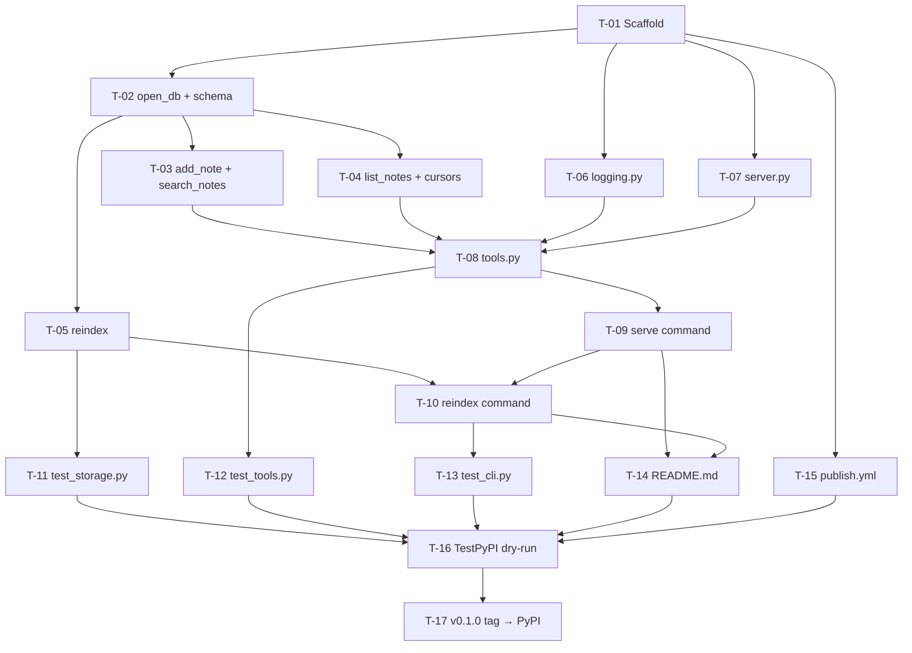

# Implementation Plan — memo-mcp v0.1.0 (2026-05-02 10:00)

**Source designs:**
- T5: `skill-outputs/generate-technical-design/generate-technical-design_memo-mcp_2026-05-01_0900.md`
- T6: `skill-outputs/batch-job-design/batch-job-design_memo-mcp-reindex_2026-05-01_0900.md`

**Developer:** Solo (Marco)
**Stack:** Python 3.11+, FastMCP, SQLite + FTS5, Typer, structlog, uv_build
**Target:** PyPI package `memo-mcp` v0.1.0

---

## 1. Phases

| # | Phase | Milestone |
|---|-------|-----------|
| 1 | Foundations | `pip install -e .` works; `memo-mcp --help` runs |
| 2 | Data layer | `storage.py` complete; all SQL queries pass unit tests against in-memory SQLite |
| 3 | MCP server | `memo-mcp serve` starts and all three tools respond correctly via FastMCP test client |
| 4 | CLI reindex | `memo-mcp reindex` runs end-to-end with correct exit codes and lock behaviour |
| 5 | Tests | Full pytest suite green; stdout-is-empty assertion passes for all tool calls |
| 6 | Packaging & release | `memo-mcp` v0.1.0 live on PyPI via OIDC trusted publishing |

---

## 2. Tasks

| ID | Title | Phase | Size | Depends on | Files / areas |
|----|-------|-------|------|------------|---------------|
| T-01 | Scaffold project structure and pyproject.toml | 1 | S | — | `src/memo_mcp/__init__.py`, `pyproject.toml`, `.gitignore` |
| T-02 | Implement `open_db()` and schema SQL | 2 | S | T-01 | `src/memo_mcp/storage.py` |
| T-03 | Implement `add_note()` and `search_notes()` | 2 | S | T-02 | `src/memo_mcp/storage.py` |
| T-04 | Implement `list_notes()` and cursor helpers | 2 | S | T-02 | `src/memo_mcp/storage.py` |
| T-05 | Implement `reindex()` | 2 | XS | T-02 | `src/memo_mcp/storage.py` |
| T-06 | Implement `logging.py` | 3 | XS | T-01 | `src/memo_mcp/logging.py` |
| T-07 | Implement `server.py` — FastMCP instance | 3 | XS | T-01 | `src/memo_mcp/server.py` |
| T-08 | Implement `tools.py` — all three tool handlers | 3 | M | T-03, T-04, T-06, T-07 | `src/memo_mcp/tools.py` |
| T-09 | Implement `cli.py` — `serve` command | 3 | S | T-08 | `src/memo_mcp/cli.py` |
| T-10 | Implement `cli.py` — `reindex` command | 4 | S | T-05, T-09 | `src/memo_mcp/cli.py` |
| T-11 | Write `conftest.py` + `test_storage.py` | 5 | M | T-05 | `tests/conftest.py`, `tests/test_storage.py` |
| T-12 | Write `test_tools.py` | 5 | M | T-08 | `tests/conftest.py`, `tests/test_tools.py` |
| T-13 | Write `test_cli.py` | 5 | S | T-10 | `tests/test_cli.py` |
| T-14 | Write `README.md` | 6 | S | T-09, T-10 | `README.md` |
| T-15 | Add GitHub Actions publish workflow | 6 | S | T-01 | `.github/workflows/publish.yml` |
| T-16 | Register trusted publisher + dry-run TestPyPI | 6 | S | T-11, T-12, T-13, T-14, T-15 | pypi.org (manual), TestPyPI |
| T-17 | Cut `v0.1.0` tag → publish to PyPI | 6 | XS | T-16 | git tag, GitHub Actions |

---

## 3. Task details

### T-01 — Scaffold project structure and pyproject.toml
**Phase:** 1 | **Size:** S

**Outcome:** Running `pip install -e .` from the repo root succeeds. `memo-mcp --help` prints the Typer help text with `serve` and `reindex` subcommands listed (stubs are fine). `import memo_mcp` works and `memo_mcp.__version__` equals `"0.1.0"`.

**Files:**
```
src/memo_mcp/__init__.py       # __version__ = "0.1.0"
pyproject.toml                 # uv_build backend, deps, entry point
.gitignore
```

**`pyproject.toml` shape (from technical design):**
```toml
[build-system]
requires = ["uv_build"]
build-backend = "uv_build"

[project]
name = "memo-mcp"
version = "0.1.0"
requires-python = ">=3.11"
dependencies = [
    "mcp>=1.27.0,<2.0",
    "typer>=0.12",
    "structlog>=24.0",
    "filelock>=3.13",
]

[project.scripts]
memo-mcp = "memo_mcp.cli:app"

[tool.uv_build.targets.wheel]
packages = ["src/memo_mcp"]
```

**Acceptance criteria:**
- `pip install -e .` exits 0
- `memo-mcp --help` shows `serve` and `reindex` as subcommands
- `python -c "import memo_mcp; print(memo_mcp.__version__)"` prints `0.1.0`
- No files under `src/memo_mcp/` emit anything to stdout on import

**Risk:** `uv_build` editable install (`pip install -e .`) has had quirks in some environments. If it fails, fallback is two lines in `pyproject.toml` to switch to `hatchling`. Test this before proceeding to T-02.

---

### T-02 — Implement `open_db()` and schema SQL
**Phase:** 2 | **Size:** S

**Outcome:** Calling `open_db()` creates the DB file + parent directories, sets WAL + busy_timeout, and runs the schema idempotently. A second call on the same path is a no-op (all `IF NOT EXISTS`). Network share paths are rejected at call time.

**Files:** `src/memo_mcp/storage.py`

**Key implementation points:**
- `_SCHEMA_SQL` constant containing all `CREATE TABLE/VIRTUAL TABLE/TRIGGER/INDEX` statements (from technical design §4)
- `open_db(db_path: str | None = None) -> sqlite3.Connection`
- Steps in order: UNC check → `mkdir(parents=True, exist_ok=True)` → `sqlite3.connect` → `row_factory = sqlite3.Row` → `PRAGMA journal_mode=WAL` → `PRAGMA busy_timeout=5000` → `executescript(_SCHEMA_SQL)` → `commit`

**Acceptance criteria:**
- Creates DB file and parent dirs when they don't exist
- Second `open_db()` call on same path succeeds (idempotent schema)
- `PRAGMA journal_mode` returns `wal` after `open_db()`
- Raises `ValueError` on UNC/network-share paths (`\\` or `//` prefix)
- `conn.row_factory` is `sqlite3.Row` (column-name access works)

---

### T-03 — Implement `add_note()` and `search_notes()`
**Phase:** 2 | **Size:** S

**Outcome:** `add_note(conn, body)` inserts a note and returns `{"id": N, "created_at": "..."}` via `RETURNING`. `search_notes(conn, query, limit)` returns rows ordered by BM25 relevance (ascending — more negative = better). FTS5 special chars pass through as-is; only `sqlite3.OperationalError` is caught and re-raised as `ValueError`.

**Files:** `src/memo_mcp/storage.py`

**Acceptance criteria:**
- `add_note` returns correct `id` and `created_at` (no `last_insert_rowid()` call)
- FTS trigger fires on insert: a search immediately after add finds the note
- `search_notes` returns empty list (not error) when no match
- `search_notes` wraps `sqlite3.OperationalError` as `ValueError` with user-facing message
- `search_notes` respects `limit` parameter (never returns more than `limit` rows)
- BM25 ordering: more-relevant result appears before less-relevant in returned list

---

### T-04 — Implement `list_notes()` and cursor helpers
**Phase:** 2 | **Size:** S

**Outcome:** `list_notes(conn, limit, cursor)` returns `{"notes": [...], "next_cursor": "..." | None}` using fetch-N+1 pattern. Cursor is base64-encoded JSON of `{"c": created_at, "i": id}`. Invalid cursor raises `ValueError` immediately in `decode_cursor()`.

**Files:** `src/memo_mcp/storage.py`

**Key implementation points:**
- `encode_cursor(created_at: str, note_id: int) -> str`
- `decode_cursor(cursor: str) -> tuple[str, int]` — wraps all exceptions in `ValueError`
- `list_notes(conn, limit, cursor)` — fetch `limit + 1` rows; cursor encodes last row of *current* page (index `limit - 1`)
- Cursor-based WHERE: `(created_at < ? OR (created_at = ? AND id < ?))`

**Acceptance criteria:**
- Empty store returns `{"notes": [], "next_cursor": null}`
- Single-page result: `next_cursor` is `null` when all notes fit in one page
- Multi-page: cursor from page 1 retrieves page 2 with no gaps or duplicates
- Exactly `limit` notes returned per page (not `limit + 1`)
- Invalid cursor raises `ValueError` with the prescribed message
- Notes ordered newest-first (`created_at DESC, id DESC`)

---

### T-05 — Implement `reindex()`
**Phase:** 2 | **Size:** XS

**Outcome:** `reindex(conn)` executes `INSERT INTO notes_fts(notes_fts) VALUES('rebuild')`, commits, and returns the note count as an integer. It is synchronous (no `async def`).

**Files:** `src/memo_mcp/storage.py`

**Acceptance criteria:**
- After manually corrupting `notes_fts` (e.g., deleting all rows), `reindex()` restores search functionality
- Returns the correct integer count matching `SELECT COUNT(*) FROM notes`
- Does not auto-create the DB (called only after DB is confirmed to exist by the CLI)
- Running twice produces same count (idempotent)

---

### T-06 — Implement `logging.py`
**Phase:** 3 | **Size:** XS

**Outcome:** `configure_logging()` sets up structlog with JSON output to stderr. `get_logger()` returns a bound structlog logger. No output goes to stdout under any condition.

**Files:** `src/memo_mcp/logging.py`

**Key implementation points (from technical design §11):**
- `logging.basicConfig(stream=sys.stderr, ...)` — explicit stderr
- `structlog.PrintLoggerFactory(file=sys.stderr)` — second layer of defence
- `MEMO_MCP_LOG_LEVEL` env var: `debug` or `info` (default `info`)
- `cache_logger_on_first_use=True`

**Acceptance criteria:**
- Calling `configure_logging()` then `get_logger().info("test", x=1)` emits a JSON line to stderr and nothing to stdout
- `MEMO_MCP_LOG_LEVEL=debug` enables debug-level output
- Unrecognised log level falls back to `info` silently (uses `getattr` with fallback)

---

### T-07 — Implement `server.py` — FastMCP instance
**Phase:** 3 | **Size:** XS

**Outcome:** `server.py` creates and exports `mcp = FastMCP(name="memo")`. Tool registrations live in `tools.py` and are attached to this instance.

**Files:** `src/memo_mcp/server.py`

**Acceptance criteria:**
- `from memo_mcp.server import mcp` works without error
- `mcp.name == "memo"`
- No tool handlers defined in `server.py` (they live in `tools.py`)

---

### T-08 — Implement `tools.py` — all three tool handlers
**Phase:** 3 | **Size:** M

**Outcome:** `notes.add`, `notes.search`, and `notes.list` are registered on the shared `mcp` instance. All input validation, error handling, and structured logging are in place. `_conn` module-level variable is injected by `cli.py` before server starts.

**Files:** `src/memo_mcp/tools.py`

**Key implementation points (from technical design §6):**
- `@mcp.tool(name="notes.add")`, `@mcp.tool(name="notes.search")`, `@mcp.tool(name="notes.list")`
- `Annotated[str, Field(...)]` with `min_length`, `max_length`, `ge`, `le` on all inputs
- `notes_add`: `body.strip()` then empty check → `storage.add_note()` → log `note_id`
- `notes_search`: `query.strip()` then empty check → `storage.search_notes()` → log `result_count`, `query_len`
- `notes_list`: `storage.list_notes()` → log `result_count`, `has_cursor`, `has_next_cursor`
- All errors raised as `ValueError` or `RuntimeError` (FastMCP converts to `isError: true`)
- Log timing: `time.perf_counter()` diff added to each log line as `duration_ms`

**Acceptance criteria:**
- `notes.add` with whitespace-only body returns `isError: true` with the prescribed message
- `notes.add` body > 10,000 chars returns `isError: true`
- `notes.search` empty query returns `isError: true`
- `notes.search` no results returns empty list (not `isError`)
- `notes.list` invalid cursor returns `isError: true`
- No writes to stdout during any tool call (assert `sys.stdout` not written)
- One JSON log line to stderr per successful tool call
- `duration_ms` field present and is a non-negative integer in every log line

---

### T-09 — Implement `cli.py` — `serve` command
**Phase:** 3 | **Size:** S

**Outcome:** `memo-mcp serve` calls `configure_logging()`, opens the DB, injects `_conn` into `tools.py`, and blocks on `asyncio.run(mcp.run())`.

**Files:** `src/memo_mcp/cli.py`

**Key implementation points:**
```python
app = typer.Typer(name="memo-mcp", add_completion=False)

@app.command()
def serve():
    configure_logging()
    conn = storage.open_db()
    import memo_mcp.tools as _tools
    _tools._conn = conn
    asyncio.run(mcp.run())
```

**Acceptance criteria:**
- `memo-mcp serve --help` exits 0 and prints help text
- `memo-mcp --help` lists both `serve` and `reindex`
- Importing `cli.py` does not open the DB or start the server (side-effect-free import)

---

### T-10 — Implement `cli.py` — `reindex` command
**Phase:** 4 | **Size:** S

**Outcome:** `memo-mcp reindex` runs the full reindex flow from the batch-job design: path resolution → UNC check → existence check → filelock → `open_db()` → `storage.reindex()` → print summary → exit 0. All failure branches exit with the correct codes.

**Files:** `src/memo_mcp/cli.py`

**Key implementation points (from batch-job design §12):**
- `_resolve_db_path(db_path: str | None) -> pathlib.Path`
- UNC check before existence check
- `FileLock(lock_path, timeout=0)` — non-blocking; `Timeout` → exit 4
- `time.perf_counter()` for timing; `typer.echo(f"Reindexed {count} notes in {elapsed:.2f}s")`
- Summary line to stdout; errors to stderr (`err=True`)
- `--db` option + `MEMO_MCP_DB_PATH` envvar on the command

**Exit codes:**
| Code | Condition |
|------|-----------|
| 0 | Success |
| 1 | DB file not found |
| 2 | `sqlite3.OperationalError` (locked or FTS5 error) |
| 3 | UNC / network-share path |
| 4 | File lock already held |

**Acceptance criteria:**
- Exit 0 with `Reindexed N notes in X.XXs` to stdout on success
- Exit 1 when DB does not exist; error to stderr
- Exit 3 for UNC path; error to stderr
- Exit 4 when lock file is manually held; error to stderr
- `--db` flag overrides `MEMO_MCP_DB_PATH`; env var overrides default path
- Does not create the DB if it doesn't exist

---

### T-11 — Write `conftest.py` + `test_storage.py`
**Phase:** 5 | **Size:** M

**Outcome:** All `storage.py` functions are covered by unit tests using an in-memory SQLite DB (`:memory:`). Tests pass with `pytest` from the repo root.

**Files:** `tests/conftest.py`, `tests/test_storage.py`

**Fixtures in `conftest.py`:**
- `db_conn` — `sqlite3.Connection` to `:memory:` DB with schema applied (synchronous, reusable across tests)

**Test coverage:**
- `open_db()`: creates parent dir, WAL mode, idempotent schema, rejects UNC
- `add_note()`: returns correct `id` + `created_at`; FTS trigger fires (search finds it)
- `search_notes()`: BM25 ordering; empty result; `OperationalError` → `ValueError`; FTS special chars pass through
- `list_notes()`: empty store; single page; multi-page cursor; exact `limit` rows; invalid cursor → `ValueError`; newest-first ordering
- `reindex()`: corrupted FTS → reindex → search restored; returns correct count; idempotent

**Acceptance criteria:**
- `pytest tests/test_storage.py` exits 0 with all tests passing
- No test writes to stdout (use `capsys` to assert)
- In-memory DB fixture uses the same `_SCHEMA_SQL` constant from `storage.py` (not a copy)

---

### T-12 — Write `test_tools.py`
**Phase:** 5 | **Size:** M

**Outcome:** Tool handlers are tested end-to-end via the FastMCP test client. Verifies the full tool → storage → response path including error shapes.

**Files:** `tests/conftest.py` (additions), `tests/test_tools.py`

**Fixtures (additions to conftest.py):**
- `mcp_client` — FastMCP test client with `_tools._conn` set to the in-memory `db_conn`

**Test coverage:**
- `notes.add`: success response shape (`id`, `created_at`); whitespace-only body → `isError: true`; body > 10,000 chars → `isError: true`
- `notes.search`: returns matching notes; empty result is not an error; FTS parse error → `isError: true`; no stdout written
- `notes.list`: correct pagination (first page, second page, last page has `next_cursor: null`); invalid cursor → `isError: true`
- Stdout assertion: every tool call leaves stdout empty (prevent regression on MCP framing corruption)

**Acceptance criteria:**
- `pytest tests/test_tools.py` exits 0
- Each error case asserts `isError: true` AND checks the exact prescribed message text

---

### T-13 — Write `test_cli.py`
**Phase:** 5 | **Size:** S

**Outcome:** CLI commands are tested with `typer.testing.CliRunner`. All exit codes and output messages verified.

**Files:** `tests/test_cli.py`

**Test coverage:**
- `reindex`: exit 0, stdout matches `Reindexed N notes in`
- `reindex`: DB not found → exit 1, stderr contains "not found"
- `reindex`: UNC path → exit 3, stderr contains "network share"
- `reindex`: file lock held → exit 4, stderr contains "already running"
- `reindex`: idempotent (run twice → both exit 0)
- `serve --help`: exits 0

**Acceptance criteria:**
- `pytest tests/test_cli.py` exits 0
- No real filesystem side effects (use `tmp_path` fixture for DB paths)

---

### T-14 — Write `README.md`
**Phase:** 6 | **Size:** S

**Outcome:** README covers: what it is, `pip install memo-mcp`, Claude Desktop config JSON block, `MEMO_MCP_DB_PATH` env var, `memo-mcp reindex` usage and scheduling, and Python version requirement.

**Files:** `README.md`

**Acceptance criteria:**
- Claude Desktop `mcpServers` JSON block is copy-pasteable and correct
- `memo-mcp reindex` scheduling instructions present for both macOS/Linux (crontab) and Windows (Task Scheduler)
- `MEMO_MCP_LOG_LEVEL` documented as a developer-only knob (not required for normal use)

---

### T-15 — Add GitHub Actions publish workflow
**Phase:** 6 | **Size:** S

**Outcome:** `.github/workflows/publish.yml` triggers on `v*` tags and publishes to PyPI via OIDC trusted publishing. No passwords or API tokens needed.

**Files:** `.github/workflows/publish.yml`

**Shape (from technical design §7):**
```yaml
on:
  push:
    tags: ["v*"]

jobs:
  build-and-publish:
    permissions:
      id-token: write
      contents: read
    steps:
      - uses: actions/checkout@v4
      - uses: actions/setup-python@v5
        with: { python-version: "3.x" }
      - run: pip install build
      - run: python -m build
      - uses: pypa/gh-action-pypi-publish@release/v1
```

**Acceptance criteria:**
- Workflow file is valid YAML (lint with `yamllint` or GitHub Actions dry-run)
- `id-token: write` permission present (required for OIDC)
- No hardcoded secrets, API keys, or passwords

---

### T-16 — Register trusted publisher + dry-run TestPyPI
**Phase:** 6 | **Size:** S

**Outcome:** `memo-mcp` is pre-registered as a trusted publisher on pypi.org. A `0.0.1a0` wheel is successfully published to TestPyPI via the GitHub Actions workflow, confirming the OIDC pipeline works end-to-end.

**Steps (manual + automated):**
1. Go to pypi.org → Publishing → Add a pending trusted publisher for `memo-mcp` (GitHub repo + workflow file name + environment `publish`)
2. Repeat on test.pypi.org
3. Temporarily add `repository-url: https://test.pypi.org/legacy/` to the workflow
4. Push a `v0.0.1a0` tag — confirm workflow succeeds and package appears on TestPyPI
5. Remove the `repository-url` override (revert to default PyPI)

**Acceptance criteria:**
- Package page exists at `https://test.pypi.org/project/memo-mcp/`
- `pip install -i https://test.pypi.org/simple/ memo-mcp==0.0.1a0` succeeds
- `memo-mcp --help` works after install from TestPyPI
- No manual PyPI password or token used

---

### T-17 — Cut `v0.1.0` tag → publish to PyPI
**Phase:** 6 | **Size:** XS

**Outcome:** `memo-mcp 0.1.0` is live on PyPI. `pip install memo-mcp` works globally.

**Steps:**
```bash
git tag v0.1.0
git push origin v0.1.0
```

**Acceptance criteria:**
- GitHub Actions workflow completes successfully
- `https://pypi.org/project/memo-mcp/` shows version `0.1.0`
- `pip install memo-mcp` on a clean Python 3.11 environment installs successfully
- `memo-mcp --help` works after install

---

## 4. Dependency graph



---

## 5. Critical path and sequencing

**Critical path (≈ 7 half-days of focused work):**

```
T-01 → T-02 → T-03 → T-08 → T-09 → T-10 → T-13 → T-16 → T-17
  S      S      S      M      S      S      S      S      XS
```

**Tasks that can be done in parallel with the critical path:**

| Point in sequence | What can be done in parallel |
|---|---|
| After T-01 | T-06, T-07, T-15 (no storage dependency) |
| After T-02 | T-04, T-05 (independent of T-03) |
| After T-05 | T-11 (storage tests) |
| After T-08 | T-12 (tool tests) |

**Walking skeleton (end of Phase 1):** After T-01, `memo-mcp --help` already proves the entry point and Typer wiring. This is the first runnable milestone.

---

## 6. Risks

| Risk | Task threatened | Why | Mitigation |
|------|----------------|-----|------------|
| `uv_build` editable install quirk | T-01 | Known occasional issue with `pip install -e .` + `uv_build` | Test immediately in T-01; fallback is two-line `hatchling` change in `pyproject.toml` |
| FastMCP test client API differs from production | T-12 | FastMCP is actively developed; test client setup may differ from docs | Pin `mcp<2.0`; write T-12 tests against actual FastMCP test client, not mocks |
| `RETURNING` clause not supported | T-03 | Requires SQLite ≥ 3.35.0 (released 2021-03-12) | Python 3.11 ships with SQLite 3.39+; verify with `import sqlite3; sqlite3.sqlite_version` in T-02 |
| stdout corruption from a transitive dependency | T-12 | A dep calling `print()` silently breaks MCP framing | stdout-empty assertion in T-12 catches this; no known risk from current dep set |

---

## 7. Open questions inherited from design

All open questions from T5 and T6 are resolved. None are blocking.

| OQ | Status |
|----|--------|
| OQ-1: `MEMO_MCP_LOG_LEVEL` in README? | Resolved — document as developer-only knob (T-14) |
| OQ-2: `query_len` vs hash for search logging? | Resolved — `query_len` is sufficient (locked in) |
| OQ-3: reindex summary to stdout or stderr? | Resolved — stdout (CLI tool, not MCP server process) |

---

## 8. Definition of done

- [ ] T-01 through T-17 all complete
- [ ] `pytest` exits 0 with no skipped tests
- [ ] stdout-empty assertion passes for all three tool calls in `test_tools.py`
- [ ] `memo-mcp serve` starts and responds to tool calls via FastMCP test client
- [ ] `memo-mcp reindex` produces correct exit codes for all 5 branches (0–4)
- [ ] `memo-mcp 0.1.0` live on pypi.org
- [ ] `pip install memo-mcp` on a clean Python 3.11 env installs and `memo-mcp --help` works
- [ ] README Claude Desktop config block is copy-pasteable and tested

---

## Next step

Run `implement-business-logic --task T-01` to scaffold the project structure and `pyproject.toml`.
