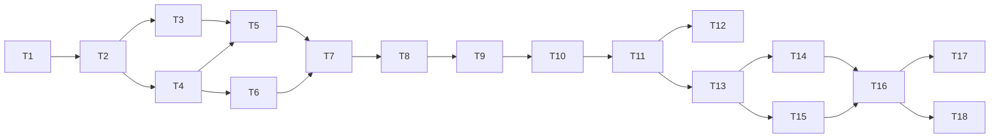

# Task Plan — build memo-mcp v0.1.0 (2026-05-01 06:54)

## Classification
- **Size:** Large
- **One-liner:** Greenfield Python package + MCP server + SQLite/FTS5 storage + batch job + CI/CD to PyPI; multi-PR scope, ~14–21 hours over ~1 week of evenings. The project is also a deliberate test bed exercising ~20 of 28 sibling skills, so the chain is intentionally wider than a typical small-feature build.

## Recommended skill chain
1. `technical-research` — confirm current Python `mcp` SDK API shape, FTS5 ranking options (`bm25`), and `src/` layout + `pyproject.toml` packaging conventions for stdio MCP servers; record a one-page evidence note.
2. `generate-functional-design` — write user stories + acceptance criteria for the three tools (`notes.search`, `notes.add`, `notes.list`) and the `memo-mcp reindex` CLI; include error/edge cases (empty query, oversized note, duplicate add).
3. `api-design` — define the MCP tool JSON schemas: input args, output shape, error codes; this is the contract Claude Desktop will see.
4. `database-design-optimization` — design the SQLite schema (`notes` table + `notes_fts` virtual table), triggers to keep FTS in sync, and indexes; spec the search query with `bm25()` ranking.
5. `generate-technical-design` — pull T1–T4 into one design doc: module layout (`memo_mcp/{server,storage,tools,cli,logging}.py`), data flow, packaging, configuration (`MEMO_MCP_DB_PATH`), failure modes.
6. `batch-job-design` — design the nightly `reindex` job: idempotent rebuild of `notes_fts` from `notes`, single-process locking, exit codes, how it's scheduled (Windows Task Scheduler / cron — document, do not automate).
7. `implementation-plan` — turn the tech design into ordered coding tickets with explicit acceptance per ticket; this becomes the build checklist.
8. `scaffold-creation` — `uv` or `hatch`-based pyproject, `src/memo_mcp/` layout, console entry point `memo-mcp = memo_mcp.cli:app`, pre-commit, GitHub Actions skeleton, `.gitignore`, MIT license.
9. `implement-business-logic` — code the storage layer, MCP server + 3 tools, and the Typer CLI with `serve` and `reindex` commands. One PR per layer if you want the skill exercised cleanly.
10. `observability-setup` — wire `structlog` JSON to stderr (stdout is reserved for MCP framing); add request_id, tool_name, duration_ms; smoke-test with `memo-mcp serve`.
11. `generate-tests` — pytest unit tests for storage + tools, one integration test that boots the server in-process and round-trips an `add` → `search`.
12. `dependency-management` — pin via lockfile, `pip-audit` for CVEs, confirm license compatibility for PyPI release.
13. `devops-deployment` — GitHub Actions: matrix test on 3.11/3.12, build sdist+wheel, publish to PyPI on tag using OIDC trusted publishing (no long-lived token).
14. `release-prep` — `CHANGELOG.md`, version bump to 0.1.0, draft GitHub release notes, tag commands.
15. `code-review` — final self-review pass over the whole diff set before tagging; check the acceptance list line-by-line.
16. `security-analysis` — input validation on the MCP boundary (note size cap, parameter types), SQL injection check (parameterized everywhere), path traversal on `MEMO_MCP_DB_PATH`, secret scan of repo before publish.

**Justification:** Mirrors the phase plan in `START_HERE.md` but adds explicit per-skill pointers and orders security/code-review *before* the PyPI tag so the released artifact is the reviewed one. `scaffold-creation` is split out from generic "implement" so the project structure is decided once, not drifted into.

## Goal
- **Outcome:** `pip install memo-mcp` produces a runnable stdio MCP server that Claude Desktop can launch; `notes.search`, `notes.add`, `notes.list` all work end-to-end against a local SQLite/FTS5 DB; `memo-mcp reindex` rebuilds the index; logs are structured JSON to stderr; all of this is published as a tagged GitHub release + PyPI v0.1.0.
- **Done when:** Every box in [START_HERE.md §Acceptance for v0.1.0](../../START_HERE.md#L43-L51) is checked, *and* the project has saved skill outputs under `skill-outputs/<skill-name>/` for each phase used.
- **Out of scope (v0.1.0):** Authentication / multi-user, sync across devices, web UI, embeddings / semantic search, attachments, edit/delete tools, tagging, export/import, Windows installer, offset-based pagination.

## Inventory (what exists)
- Repo contents: only `START_HERE.md` — fully greenfield.
- No git repo yet (`git init` is implicit in scaffolding).
- Stack already proposed in `START_HERE.md`; T1 (`technical-research`) confirms or replaces.
- No prior MCP code in this directory; reference impl will come from the upstream `mcp` SDK examples (validated in T1).

## Subtasks
| ID  | Subtask                                                          | Skill to invoke                  | Size | Risk | Conf | Depends on |
|-----|------------------------------------------------------------------|----------------------------------|------|------|------|------------|
| T1  | Confirm stack + `mcp` SDK API + FTS5/packaging patterns          | `technical-research`             | S    | Med  | Med  | —          |
| T2  | Functional design: 3 tools + reindex CLI, with ACs               | `generate-functional-design`     | S    | Low  | High | T1         |
| T3  | MCP tool JSON schemas (search/add/list)                          | `api-design`                     | S    | Low  | High | T2         |
| T4  | SQLite schema + FTS5 virtual table + sync triggers + bm25 query; `notes(id,body,created_at,tags TEXT NULL)`; WAL mode | `database-design-optimization` | S | Med | High | T2 |
| T5  | Technical design: module layout, config, data flow               | `generate-technical-design`      | M    | Low  | High | T3, T4     |
| T6  | Nightly reindex job design (idempotent, locked, schedulable)     | `batch-job-design`               | S    | Med  | High | T4         |
| T7  | Implementation plan: ordered tickets w/ acceptance per ticket    | `implementation-plan`            | S    | Low  | High | T5, T6     |
| T8  | Scaffold project (pyproject, src layout, CI skeleton, license)   | `scaffold-creation`              | S    | Low  | High | T7         |
| T9  | Implement storage layer (SQLite/FTS5, triggers, queries)         | `implement-business-logic`       | M    | Med  | High | T8         |
| T10 | Implement MCP server + 3 tools wired to storage                  | `implement-business-logic`       | M    | High | Med  | T9         |
| T11 | Implement `memo-mcp serve` and `memo-mcp reindex` CLI            | `implement-business-logic`       | S    | Low  | High | T10        |
| T12 | Wire structlog JSON to **stderr** (stdout reserved for MCP)      | `observability-setup`            | S    | Med  | High | T11        |
| T13 | Tests: unit (storage, tools) + 1 in-process server integration   | `generate-tests`                 | M    | Med  | Med  | T11        |
| T14 | Lockfile, `pip-audit`, license check                             | `dependency-management`          | S    | Low  | High | T13        |
| T15 | GitHub Actions: test matrix + build + PyPI publish via OIDC      | `devops-deployment`              | M    | High | Med  | T13        |
| T16 | CHANGELOG, version bump, release notes draft, tag commands       | `release-prep`                   | S    | Low  | High | T14, T15   |
| T17 | Self-review of full diff against acceptance list                 | `code-review`                    | S    | Low  | High | T16        |
| T18 | Security pass: input caps, parameterized SQL, path traversal     | `security-analysis`              | S    | Med  | High | T16        |

**Sizing rollup:** 12×S + 5×M + 0×L → fits ~14–18 hours, leaves slack for the high-risk items (T10, T15).

## Dependency graph

## Critical path
T1 → T2 → T4 → T5 → T7 → T8 → T9 → T10 → T11 → T13 → T15 → T16 → T17/T18  (≈ 14–18 hours)

T3 (api-design) and T6 (batch-job-design) run off the critical path and can be slotted opportunistically. T17 and T18 can run in parallel after T16 (both are read-only review passes).

## Risks
- **T10 — MCP SDK API drift / framing surprises (High).** The `mcp` Python SDK is young; tool registration and stdio framing have changed across versions. *Mitigation:* T1 spike pins the exact SDK version and copies a known-good "hello world" tool registration into the design doc before T10 starts.
- **T15 — PyPI publish from CI on first attempt (High).** OIDC trusted publishing requires a configured PyPI project + identity provider mapping; first tag often fails. *Mitigation:* publish a `0.0.1a0` pre-release to TestPyPI first to shake out the workflow; only then cut `0.1.0` to real PyPI.
- **T12 — Logging to stdout will silently corrupt MCP framing (Med).** Any stray `print()` or default structlog config breaks Claude Desktop's parser. *Mitigation:* assert in tests that nothing writes to stdout during a tool call; structlog handler explicitly bound to `sys.stderr`.
- **T4/T9 — FTS5 trigger correctness (Med).** External-content FTS5 needs `INSERT/UPDATE/DELETE` triggers to stay in sync; easy to forget one and silently lose updates. *Mitigation:* one integration test does add → search → update (when applicable) → search to prove the triggers fire.
- **T9/T11 — Concurrent write contention (Med).** WAL mode tolerates one writer + many readers, but `reindex` and a live server writing simultaneously can still queue-lock briefly. *Mitigation:* `PRAGMA journal_mode=WAL; PRAGMA busy_timeout=5000;` set on every connection open; document "reindex is safe to run alongside serve, but expect up to 5 s of write latency."
- **T1 — Stack assumption may be wrong (Med).** If the SDK requires asyncio in a way `Typer` fights, the CLI shape changes. *Mitigation:* T1 explicitly checks "can a Typer command host an async MCP server cleanly" before T5 commits to the structure.
- **Time budget — feature creep over 7 evenings (Med).** Easy to add edit/delete tools mid-build. *Mitigation:* the **Out of scope** list above is the contract; revisit only after v0.1.0 ships.

## Decided (formerly open questions)

| # | Decision | Rationale | Affects |
|---|----------|-----------|---------|
| Q1 | `MEMO_MCP_DB_PATH` env var; fallback `~/.memo-mcp/notes.db` | Lets tests and Claude Desktop use separate DBs without code changes | T4, T5, T8, T18 |
| Q2 | `notes.add(body)` only; schema has nullable `tags TEXT` column but it is not exposed in v0.1.0 | Keeps MCP contract minimal; avoids the tag taxonomy UX problem; zero-cost migration path | T2, T3, T4 |
| Q3 | `notes.list`: newest-first, `limit` (default 20); cursor pagination on `(created_at, id)` — **no offset** | Offset breaks when notes are added between calls; cursor is same implementation complexity and correct by default | T3, T9 |
| Q4 | Check `pypi.org/project/memo-mcp/` **before T8** (scaffold); if taken, fallback order: `memo-mcp-server` → `mcp-memo` → `<handle>-memo-mcp`; name must match across `pyproject.toml`, CLI entry point, and GitHub repo | Renaming after publish is painful | T8, T15 |
| Q5 | `PRAGMA journal_mode=WAL; PRAGMA busy_timeout=5000` on every connection; document that `reindex` is safe to run alongside `serve` with ≤5 s write latency | WAL allows concurrent reads; busy_timeout avoids hard `OperationalError: database is locked` | T4, T9, T11 |

## Pre-T8 action (do this now)
Check `pypi.org/project/memo-mcp/` — if the name is taken, pick the fallback before scaffolding. Record the chosen name here and update the next-action brief.

## Next action
Run `technical-research` (T1) with the brief: "Confirm `mcp` Python SDK current version, minimal stdio server example, and that a Typer CLI (`typer`) can host an async MCP server cleanly; confirm FTS5 external-content + bm25 pattern with WAL mode; confirm OIDC trusted publishing setup for PyPI (what the `pyproject.toml` + GitHub Actions config must look like)." Output: a one-page evidence note saved under `skill-outputs/technical-research/`.
